# 鹰眼 · 四大问题诊断与改进建议

> 用途：第二轮补充诊断。针对用户提出的四个具体问题——① 两库/KB 录入效率低、② 医院数据接入与 OCR 批量导入、③ 自查自纠强化、④ 规则粒度与交叉——做代码级验证与改进建议，作为与 Claude 讨论结构性重构的弹药。
> 关系：与 [鹰眼-现状梳理与重构议题-briefing.md](鹰眼-现状梳理与重构议题-briefing.md) 配套；本文四个问题分别对应该文第三部分的议题 1/3/4/5（见第 5 节衔接说明）。
> 生成日期：2026-07-02。所有结论均有代码/数据文件证据，逐条附路径。

---

## 第 1 节 · KB/两库录入效率：诊断与建议

### 1.1 诊断结论

**"录入效率低"属实。** 现有链路是「手写种子 JSON → 手动跑爬虫 → JSON 合并 → 手改 verify_status」，批量能力仅限"URL 种子批跑"，**不能把本地一批 xlsx/PDF 直接丢进去入库**。

### 1.2 现有链路步骤图（手动 vs 自动）

```mermaid
flowchart TB
  subgraph manual [手动环节]
    A["人工发现数据源URL<br/>(调研文档)"]
    B["手写 seeds.batchN.json"]
    C["人工改 verify_status / linked_rules<br/>(直接编辑JSON)"]
  end
  subgraph auto [自动环节]
    E["node run.mjs --phase batchN"]
    F["列表翻页+附件下载"]
    H["parsers/* 解析 xlsx/pdf/html"]
    I["mergeIntoKb 写入 kb1_policies.json"]
  end
  subgraph opt [手动触发的可选环节]
    K["ingest-kb-to-supabase.js"]
    L["embed-kb-chunks.js"]
  end
  A --> B --> E --> F --> H --> I
  I -.-> C
  C --> K --> L
```

### 1.3 五大瓶颈（逐条带证据）

| # | 瓶颈 | 证据 |
|---|---|---|
| 1 | **种子必须手写**：每个数据源要在 seeds JSON 里手工声明 id/url/type/parser/filter，无"发现即入库" | [scripts/crawl/seeds.batch1.json](../scripts/crawl/seeds.batch1.json)；`run.mjs` 只认 `seeds.${phase}.json`，不存在直接抛错 |
| 2 | **两库 xlsx 解析异常率 ~22%**：`findHeaderRow` 启发式找表头，错位就把"序号"当正文入库——781 条中约 172 条坏行（text="序号"/"1"）至今留在库里 | [scripts/crawl/parsers/xlsx-liangku.mjs](../scripts/crawl/parsers/xlsx-liangku.mjs)；[prototype/data/kb/kb1_policies.json](../prototype/data/kb/kb1_policies.json) 中 `"text": "序号"` 的条目 |
| 3 | **PDF 解析故意截断**：药品目录/江苏目录 parser 写死 `demoOnly: true`，只保留 5 个演示药品；江苏 xlsx 超 30 行也只留 DEMO_DRUGS 名单 | [scripts/crawl/parsers/pdf-drug-catalog.mjs](../scripts/crawl/parsers/pdf-drug-catalog.mjs)、`parsers/catalog-row.mjs`、`parsers/xlsx-jiangsu.mjs` |
| 4 | **不支持本地批量丢文件**：`downloadToRaw` 只对 URL fetch，无 `file://`/目录扫描；想批量入库必须先把文件挂到可访问的 URL 上 | [scripts/crawl/lib/fetch.mjs](../scripts/crawl/lib/fetch.mjs) |
| 5 | **人工核实无工作流 + verified 判断 bug**：核实=直接改 JSON，无队列/UI；且引擎用 `startsWith('✅')` 判 verified，导致 **"✅爬虫入库(待人工抽检)"也被当作已核实**，门禁对爬虫条目不降级 | [scripts/crawl/config.mjs](../scripts/crawl/config.mjs)（`verifyStatus: '✅爬虫入库(待人工抽检)'`）；[prototype/app/kb/retrieval.js](../prototype/app/kb/retrieval.js)（`policyVerified[e.ref_id] = (e.verify_status || '').startsWith('✅')`） |

另有次要瓶颈：col109 新批次无定时监控（靠人工 rerun）；403 页面仅标记 `needs_playwright`，Playwright 降级未接入主流程；单次 crawl run 因 2–4s 节流最长跑过 ~48 分钟（`public-data-corpus/manifest.json` 的 `crawl_runs`）。

### 1.4 改进建议（按性价比排序）

1. **修两库 parser + 加质量门**（最高优先）：加固 `xlsx-liangku.mjs` 的表头识别（按 sheet 名映射列），并在 `mergeIntoKb` 前加质量门——拒绝 `text` 长度过短或匹配 `/^(序号|\d+)$/` 的行。顺手清洗库内 172 条存量坏行。
2. **新增本地批量导入脚本** `scripts/bulk-import-local.mjs`：扫描本地目录 → 按扩展名路由到现有 parsers → 调 [scripts/crawl/lib/merge-kb.mjs](../scripts/crawl/lib/merge-kb.mjs) 的 `mergeIntoKb`。merge 核心不用改（它已有 ref_id upsert + "✅已核实"保护机制），成本很低，直接解决"批量录入"诉求。
3. **关掉 demoOnly 跑全量**：药品目录/江苏目录的截断是当时为 demo 设的开关，不是能力缺陷；关掉后配合质量门即可扩量。
4. **看板加"待核实队列"页面**：KB 条目的 `verify_status` 字段齐全，[prototype/app/engine/foundation.js](../prototype/app/engine/foundation.js) 已有规则↔KB 覆盖率统计可复用；缺的只是一个"逐条过、点确认、写回 verify_status"的 UI，把人工核实从改 JSON 变成流水线。
5. **收紧 verified 判断**：`retrieval.js` 区分 `✅已核实` 与 `✅爬虫入库`，让三要素门禁对未抽检条目正确降级。这是实质 bug 修复。
6. **col109 增量监控**：加一个定时任务（cron 或 CI schedule）跑 `run.mjs --phase batch2` 的 col109-watch 种子，新批次自动入库并通知。

### 1.5 "KB 信息更显性"的方向

当前 KB 的结构化信息（药品编码、限定条件、规则分类）都埋在 `metadata` 里或 flatten 进 `text`（用 ` · ` 连接），**引擎只消费 `ref_id → text` 映射**：

- `linked_rules` 字段设计了双向链接，但**引擎零引用**（爬虫条目全为空数组，Supabase 建了 GIN 索引也没人查）；运行时只有单向的 `rules.policy_basis → ref_id`。
- 规则引擎因此只能硬编码知识（如 T-201 的 6 种靶向药名、A-101 的 2 个术式内涵表）。

**建议**：给 KB 条目增加结构化字段（`payment_condition` 限定支付条件、`amount_threshold`、`item_code`），让规则的 `params` 直接引用 KB 表而不是复制进代码——这同时是第 4 节规则重组的前置条件。API 层面在 `/api/kb/search` 返回 `linked_rules`/`violation_tags`/`verify_status`，前端按维度可浏览。

---

## 第 2 节 · 医院接入 + OCR 批量导入：诊断与建议

### 2.1 诊断结论

访谈得到的判断（**收费/价格 = 标准化编码数据；病历 = 零散 PDF/扫描图片**）与产品主张（"医院开 API + 自建 OCR 批量吃掉零散材料"）方向正确，且现有代码骨架完整；但**两条通路各自都有关键缺口，而且互相没有接起来**。

### 2.2 现状能力矩阵

| 数据形态 | 通路 | 完成度 | 关键问题 |
|---|---|---|---|
| 结构化 JSON（完整/片段案卷） | `POST /api/intake/batch` / `/api/ingest` | 高 ~90% | 已可用，有契约校验 |
| CSV/TXT 费用明细 | `parseCsvFeeList` 启发式列名匹配 | 中高 ~75% | **无医保码/国标码字段** |
| 数字 PDF 费用表 | L1 lite(pdfplumber) → 表格提取 | 中 ~65% | 表格+bbox 较完整，是最强的一路 |
| 扫描 PDF/图片费用表 | PP-StructureV3 或 tesseract | 中低 ~50-60% | **PP-Structure 默认未装**（requirements.txt 不含 paddle），常回退 lite/tesseract |
| 扫描病历类（首页/病程/医嘱/检验） | OCR 文本 → LLM 抽字段 | 低中 ~35-45% | 需 LLM key；失败退化成纯文本块，无字段级 bbox |
| 医院 API（HIS/FHIR/HL7） | connector `pullEncounter` | Mock 可跑 / 真实 ~5% | **FHIR/HL7 只有契约骨架，拉取未实现** |

证据：[prototype/app/connectors/hospital.js](../prototype/app/connectors/hospital.js)（FHIR `pullEncounter` 直接返回 `'FHIR 拉取未实现（契约已声明）'`）；[prototype/ppstructure/server.py](../prototype/ppstructure/server.py)（三档引擎回退逻辑）；[prototype/app/engine/intake-batch.js](../prototype/app/engine/intake-batch.js)。

### 2.3 五个关键差距

1. **编码层缺失**：Mock/FHIR 契约把收费映射到 `item_name/qty/amount`，**没有 `item_code`/医保码/国标码字段**——而这恰是医院数据最标准化、最该先接的部分。费用行与医嘱的 `linked_order` 关联也假设医院直接给出。
2. **API 与 OCR 两条路互不相连**：没有"同一就诊号（encounterId）下，API 拉的编码数据 + OCR 解析的 PDF 材料统一合并"的机制。这是"医院 API 抓取 + OCR 批量导入"产品主张的核心闭环，目前缺失。
3. **一等槽位合并不通**：分类器认识 `settlement_list`（医保结算清单）、`drg_grouping`、`trace_code`（追溯码）、`inpatient_metrics` 这些槽位，但 [prototype/app/engine/intake-merge.js](../prototype/app/engine/intake-merge.js) 的 `keyMap` 里没有它们——**解析成功也合并不进案卷**。
4. **批量非生产级**：请求体上限 ~5MB（`server.js` `readBody` 中 `data.length > 5e6` 即断开）、批内串行解析、无 job 队列/失败重试/断点、原始文件不持久化（只留 layout JSON 缓存）。
5. **PDF 病历无回退**：`intake-batch.js` 中 PDF 解析失败直接报错（仅图片有 vision LLM 回退），与"大量零散 PDF"的真实场景冲突；未识别的 PDF 默认按 `fee_list` 解析，病历类易误判。

### 2.4 落地顺序建议

1. **编码字段模型**（先做，最便宜）：`fee_list.items[]` 增加 `item_code`/`insurance_code`/`order_id`，CSV/JSON/FHIR mapper 同步支持——让"标准化编码数据"这条最容易的路先名副其实。
2. **实现一个真实拉取器**：不必先啃 FHIR 全协议；按访谈到的医院实际形态做 HIS REST/数据库视图版 `pullEncounter`（connector 插件接口现成），支持就诊列表+增量同步。
3. **双路按就诊号合并**：`encounterId` 作主键，API 编码数据先落地，OCR 材料以槽位片段方式 merge 进同一案卷（`intake-merge.js` 机制可复用）。
4. **接通一等槽位**：settlement_list/drg_grouping/trace_code 进 `keyMap` + 各自专用 mapper（或直接约定 JSON schema 由 API 侧给）。
5. **批量生产化**：异步 job 队列 + per-file 重试 + 原始文件对象存储，摆脱 5MB 同步 POST；PP-Structure 在 Docker 里预装或明确"lite 只支持数字 PDF"的 SLA。
6. **病历样例补齐**：`prototype/data/intake_samples/` 目前只有 3 个费用清单 demo，**没有一份病案首页/病程/医嘱扫描样例**——要验证"零散病历 PDF"通路，先造样例。

**可复用资产**（不用从零开始）：摄取三层架构（`ingest.js`）、批量链路（intake-batch/merge/classifier 闭环）、L1 sidecar 统一 layout 契约、费用 bbox 验收脚本（`scripts/verify-intake-bbox.js`）、connector 插件点、导入批次审计（`priority-store.recordImportBatch`）。

---

## 第 3 节 · 自查自纠：现状与四块缺口

### 3.1 诊断结论

自查自纠是全项目**文档主张与代码骨架最齐的一条线**，也与政策风向最同向（2026 年 12 领域强制自查、"自查从宽被查从严"、五年行动计划"关口前移"）。要把它立成产品主轴，缺的不是叙事，是**闭环的最后四块硬功能**。

### 3.2 已实现清单（骨架完整）

| 能力 | 位置 | 完成度 |
|---|---|---|
| 体检模式入口 + UI 双口径（疑点→风险点、责令退回→主动退回） | `prototype/app/public/home.html`、`app.js` `applyModeUI` | 高 |
| 规则子集过滤（排除 E-对抗/P-药店） | [prototype/app/server.js](../prototype/app/server.js) `filterRulesForExam` | 高 |
| 整改登记（时限/状态/院端说明，回流 review_feedback） | `/api/rectification` | 中 |
| 自查整改清单导出（MD/HTML/PDF） | `/api/export/checklist?mode=exam` | 高 |
| 违规性质分流（主观嫌疑 vs 非主观差错 + 重复升级规则） | [prototype/app/engine/priority-nature.js](../prototype/app/engine/priority-nature.js) | 高（限优先队列） |
| 举证包 / 违规统计表 / 申诉副驾 | `evidence-package.js`、`violation-report.js` | 中 |

设计红线已验证：同一案卷在稽核/体检两种模式下，三态判定与分数一致，只有规则集与措辞不同（iter-20，`prototype/docs/ITERATION_REPORTS.md`）。

### 3.3 四块缺口（真实医院医保办用起来缺什么）

1. **全量问题清单工作台**（最值得做，数据已备齐）
   - KB 已入库 12 领域 **236 条官方问题清单原文**（[prototype/data/kb/kb1_problem_lists.json](../prototype/data/kb/kb1_problem_lists.json)），但自查清单模块只有 **5 条演示映射**、只读展示命中数（[prototype/app/engine/checklist-store.js](../prototype/app/engine/checklist-store.js) 的 `DEFAULT_CHECKLIST`）。
   - 缺的形态：逐条勾选（未查/已查无问题/发现问题/已整改）+ 按科室分派 + 完成率仪表盘。这正是政策要求医院回溯两年、逐领域自查的工作形态。
2. **整改前后复跑对比**（承诺了但是 mock）
   - 首页与院端一页纸都写了"整改后重跑对比"，实际**没有 audit 快照持久化、没有 diff 报告**；海报里的"已复跑留痕"是纯 UI mock。需要：自查产生 snapshot → 整改后复跑 → 逐 finding diff（消失/仍在/新增）→ 留痕台账。
3. **主动退回金额测算**（ROI 叙事核心，0 实现）
   - "自查从宽、期限前主动退回可减免"是院端买单的第一理由（对照案例：内蒙古人民医院飞检认定 3466 万 vs 自查仅退 3.23 万，SSOT §4.3），但代码里没有任何"建议退回金额汇总 / 按 38 条 vs 40 条性质分档 / 与飞检暴露金额对比"的测算模块。
4. **一致性修复**（低成本、高一致性收益）
   - `violation_nature` 只在优先队列链路生效，**主工作台 `POST /api/audit?mode=exam` 不调用 `enrichFindingsPipeline`**——医保办在单案自查时看不到主观/非主观分流。
   - 机构画像 `institutionPortrait()` 与三阶段地图 `/api/three-stage` 调 `runAuditForRecord` 时**没传 examMode**，院端看到的数字混入了 E-/P- 监管侧规则，与体检模式叙事不一致。
   - 违规统计表仅 JSON/Markdown，v2 构建 prompt 要求的 Excel/PDF 官方三联格式（自查报告+违规台账+主动退回申请表）未实现。

### 3.4 对监管侧的价值表述（供叙事强化）

自查自纠对监管方的价值链已在文档中论证充分，可直接引用：院端自查干净 → 流到飞检的问题变少（关口前移、源头治本）→ 监管稀缺人力集中在真正的主观骗保上。改进建议：把这条"监管侧间接价值"与第 4 块的 violation_nature 分流打通——**自查报告里显式区分"非主观差错（主动退回即可）"与"主观嫌疑（需重点说明）"**，让监管方看到的自查产物质量更高，这是双边价值的连接点。

---

## 第 4 节 · 规则粒度与交叉：诊断与重组方案素材

### 4.1 诊断结论

用户的三个直觉**全部被 58 条规则的逐条评审证实**：

| 直觉 | 验证 |
|---|---|
| 有的规则太大、包罗万象 | 成立：多条规则在 `trigger_logic` 里并列 2–4 种独立违规情形 |
| 有的规则太稀疏 | 成立：58 条中 30 条无 checker；多条硬编码单一药品/术式 |
| 规则交叉、组织不好 | 成立：仅"重复收费"一个行为散在 8 条规则；专科规则是通用规则的复制粘贴特化；yaml 的 `relations` 字段引擎不读 |

另有基础性不一致：`rules.yaml` meta 写 41 条、`docs/01-审核规则库雏形.md` 写 33 条、实际 `rules.json` 是 **58 条**——三处口径脱节。

### 4.2 "过宽"典型（一条规则混多种违规）

- **A-107 串换**：一条规则混 3 种情形——药品串换 / 目录外服务冒充目录内 / 低值耗材按高值——三者的证据链、条款（条例 38 条第四项 vs 第六项）、对质话术均不同（[prototype/data/rules/rules.yaml](../prototype/data/rules/rules.yaml) L358-363）。
- **A-110 范围外结算**：混 3 路径（目录外 / 商保创新药反向校验 / 生活服务类）。
- **M-302 麻醉监测重复**：把官方清单 3 个序号（监测内涵 / 序号159 气管插管 / 序号157 椎管内置管）塞进一条。
- **T-206**：混"过度检查（→线索）"和"重复收费（→疑点）"两种定性。
- **B-201 超限定支付**：yaml 定义是通用五步法（解析目录"限"字条款→逐要素找证据），**引擎实现却只查人血白蛋白**（正则 `/人血白蛋白/`）——"定义宽、实现窄"的代表。

### 4.3 "过窄/稀疏"典型

- **T-201**：`params` 硬编码 6 种靶向药名（奥希替尼/吉非替尼/厄洛替尼/阿来替尼/克唑替尼/西妥昔单抗），新 TKI 上市要改代码——应改为 KB 目录"限基因检测"备注驱动。
- **A-101 引擎实现**：yaml 写"读 KB1 项目内涵"，引擎是 `SURGERY_CONNOTATION` 常量表里**仅 2 个骨科术式**（[prototype/app/engine/audit-engine.js](../prototype/app/engine/audit-engine.js) L51-54）。
- **D-401 引擎实现**：`SEVERITY_CODING` 仅"重症肺炎"一条编码路径。
- **空壳簇**：C-304/D-403/E-501（L3 占位）、CV-301/302、BP-301（yaml 自承"待官方核"）等 30 条无 checker。

### 4.4 交叉/重叠矩阵（核心几簇）

| 重叠簇 | 涉及规则 | 性质 |
|---|---|---|
| 重复收费·内涵 | A-101, A-102, F-005, M-302, ICU-301, IMG-301, CV-301, BP-301 | **定义层平行重复**：专科规则=A-101 的场景实例，却各自复制整段逻辑 |
| 超限定/范围外 | B-201, A-110, T-201 | 同一笔药三角重叠（引擎故意三 checker 同跑白蛋白靠合议归并） |
| 多记数量 | A-109, T-204, M-303（+引擎幽灵 ID A-109MAT） | T/M 为 A-109 专科切片 |
| DRG 高套 / 费用转嫁 | D-401 vs T-208；D-402 vs T-207 | T 系明文"D-40x 特化"，编号却平级，语义是 extends |
| 分解 vs 重复 | A-106 vs A-101 | 同一术式子步骤定性不同，可能同行双报 |
| 挂床 ⊂ 分解住院 | C-301 `subsumes: [C-302]` | **yaml 声明了，reconcile 未实现** |

**机制层病因**：合议 `reconcile()` 只做结果层"按费用行聚类去重"，**不读 yaml 的 `relations`**（全库仅 3 处使用）、`requires` 字段零使用、meta 里的 `global_suppression_list`（如放化疗周期豁免 C-301）**引擎 grep 零匹配**——`docs/08-规则逻辑评审.md` 设计的定义层治理停留在文档。

**命名双轨混乱**：F/A/B/C/D/E 六类通用 + T/M/ICU/P/IMG/CV/BP 专科前缀并行；T 系规则的 `category` 漂移挂靠在 A/B/D 下；序号撞号（C-301/M-301/ICU-301 同为 301）。

### 4.5 重组方案素材：「违规行为本体 × 专科场景」二维矩阵

**轴 1 = 违规行为本体**（对齐条例 38/40 条 + 官方问题清单的条目类型）：

| 本体 | 现有规则分散情况 |
|---|---|
| 重复收费 | 散在 8 条（A-101/102, F-005, M-302, ICU-301, IMG-301, CV-301, BP-301） |
| 超标准/超量 | A-103/104/105/109, F-004, T-204, M-301/303, ICU-302 |
| 串换 | A-107, P-303, CV-302, IMG-302(半) |
| 虚构/虚记 | A-108, F-003, C-304, P-301 |
| 超限定/范围外 | B-201, A-110, T-201, T-205(半) |
| 过度诊疗 | B-202~208, T-202/203/206(半) |
| 分解/挂床住院 | C-301/302, A-106 |
| DRG/DIP | D-401/402/403, T-207/208 |
| 资质/欺诈/对抗 | E-501~503, P-302 |

**轴 2 = 专科场景**：用 `specialty_tags` + 官方问题清单领域表达，不再新造 rule_id 前缀。

**重组三原则**：

1. **原子规则** = 一个本体 × 一条 trigger 谓词（如 `REPEAT_CONNOTATION` 内涵重复），逻辑只写一次。
2. **专科差异走 params**：麻醉/ICU/影像/心血管/血净的内涵对照表、药品清单做成 KB 驱动的参数表（`params.connotation_profiles[]`），替代复制规则和硬编码常量（呼应第 1 节 KB 显性化）。
3. **父子关系走 extends**：T-207/T-208 等改为 `extends: D-402/D-401` + 肿瘤 tag，而非平级复制。

**优先动刀清单（重组 MVP）**：

1. 拆 A-107 → 药品串换 / 服务串换 / 耗材高低值串换 三条原子规则
2. 拆 A-110 → 目录外 / 商保创新药 / 生活服务类 三条
3. 合并 8 条重复收费族 → 统一 A-101 + 专科参数表
4. T-204/207/208 取消平行定义 → `extends` A-109/D-402/D-401
5. B-201 引擎化：从白蛋白硬编码升级为 params 驱动的"限"字条款解析器
6. **让 reconcile 真正读 `relations` 与 `global_suppression_list`**：实现 subsumes/互斥/全局豁免的定义层仲裁，否则 doc08 的合议设计永远停在结果层补丁
7. 统一三处规则数口径（yaml meta / doc01 / rules.json），消灭幽灵 ID A-109MAT

保留项：L1/L2/L3 分层继续用（与本体正交：L1=可代码谓词、L2=需语义、L3=需外部数据）；F/A/B/C/D/E 六类降级为"报告章节/覆盖度维度"，不再做 rule_id 前缀。

---

## 第 5 节 · 与既有重构议题的衔接

本文四个问题与 [鹰眼-现状梳理与重构议题-briefing.md](鹰眼-现状梳理与重构议题-briefing.md) 第三部分议题的对应关系：

| 本文章节 | 对应 briefing 议题 | 补充了什么 |
|---|---|---|
| 第 1 节 KB 录入效率 | 议题 1（数据真实性：广度 vs 深度） | 无论选广度还是深度，录入流水线的五个瓶颈都要先修；本地批量导入 + 核实队列是两条路的公共前置 |
| 第 2 节 医院接入 + OCR | 议题 4（可交付：集成方式）+ 议题 3（OCR bbox 真填） | 用访谈证据（收费=编码、病历=零散PDF）确认了"材料包导入 + API 拉编码数据"的混合集成形态，并给出五个具体缺口 |
| 第 3 节 自查自纠 | 议题 2（主战场：监管 vs 院端） | 为"押院端自查"提供了落地弹药：骨架已齐，闭环缺四块（清单工作台/复跑diff/退回测算/一致性修复），做完即成院端主轴 |
| 第 4 节 规则重组 | 议题 5（技术架构）+ 议题 1 | 把"规则粒度混乱"从直觉变成了逐条证据，并给出「本体×场景」二维矩阵与优先拆分清单，是结构性重构中最具体的一块 |

**与 Claude 讨论时的建议入口**：如果 briefing 的三大分叉（广覆盖 vs 单场景 / 确定性 vs 真LLM / demo 数据 vs 真实数据）是战略层，那本文四节就是执行层——其中**第 4 节规则重组**和**第 1 节录入流水线**不依赖任何战略分叉的答案，属于"无论怎么选都要做"的公共地基，可以先动。

---

## 落地进度（2026-07-02 实施记录）

本文诊断出的问题已完成第一轮代码落地（五阶段，全部通过 `bash yhf/run.sh --strict` 全绿、看板前端契约校验、优先通路 gold eval 7/7）：

### 阶段 A · 实质 bug 与一致性修复

- **A1** [prototype/app/kb/retrieval.js](../prototype/app/kb/retrieval.js)：verified 判断收紧——仅人工核实算 `✅已核验`，爬虫入库条目单独标 `policyPending`，报告政策引用改为三态标注（已核验 / 🕒爬虫入库·待人工抽检 / ⚠待核验）。合规门禁行为不变（C-002 只在条款不在库时降级）。
- **A2** 单案 `/api/audit`（标准/exam/super/llm 全路径）接入 `violation_nature` 性质标注与处置口径，主工作台 finding 卡新增性质徽标（[prototype/app/public/app.js](../prototype/app/public/app.js)）。
- **A3** `/api/institution`、`/api/export/institution`、`/api/three-stage` 支持 `?mode=exam`，体检口径下走 exam 规则子集，返回 `rule_scope` 标注；前端体检模式自动带参。
- **A4** `rules.yaml` meta 口径修正为 58 条，`build-rules.js` 增加 meta 与实际条数一致性校验。

### 阶段 B · KB 录入提效

- **B1** 两库 parser 表头识别加固（前 20 行按列名命中数打分取最优）+ 双层质量门（[scripts/crawl/lib/quality.mjs](../scripts/crawl/lib/quality.mjs)：parser 层 + merge 层拒绝纯序号/合计/无连续汉字行）。
- **B2** [scripts/clean-kb-badrows.mjs](../scripts/clean-kb-badrows.mjs) 已执行：KB1 **1467 → 1295 条**（清除 172 条坏行，残余 junk 为 0），corpus 副本与 manifest 已同步（顺带修复 manifest.json 一处尾逗号 JSON 语法错误）。
- **B3** [scripts/bulk-import-local.mjs](../scripts/bulk-import-local.mjs)：本地目录/文件批量入库（文件名启发式 parser 路由 + `--dry-run` + 超大 PDF 跳过阈值），已用 raw 目录 27 个真实附件 dry-run 验证（可解析出 751 条）。
- **B4** demoOnly 截断改为 `KB_FULL_IMPORT=1` 环境变量可解除（pdf-drug-catalog / xlsx-jiangsu 两处）。

### 阶段 C · Intake 缺口修补

- **C1** [prototype/app/engine/intake-merge.js](../prototype/app/engine/intake-merge.js)：`settlement_list`/`drg_grouping`/`trace_code`/`inpatient_metrics` 四个一等槽位接入 keyMap（含未预置槽位的初始化与数组合并），`slotFillStatus` 同步显示。
- **C2** `fee_list.items[]` 支持 `item_code`（HIS 收费编码）/`insurance_code`（医保贯标码）透传：CSV parser、ppstructure 表格 mapper、MockHIS 契约与 FHIR mappingContract 同步更新。

### 阶段 D · 自查自纠闭环三件套

- **D1** 全量清单工作台：`GET /api/checklist/full`（从 KB 236 条官方清单生成，违规类型→规则映射 + 引擎命中对照）+ `POST /api/checklist/progress`（未查/已查无问题/发现问题/已整改 + 科室 + 说明，落盘 `checklist_progress.json`）；`priority.html` 弹窗升级为按领域折叠、逐条勾选、完成率统计。
- **D2** 复跑对比：[prototype/app/engine/exam-snapshot.js](../prototype/app/engine/exam-snapshot.js)——体检模式每次自查落快照，`GET /api/exam/diff` 按 finding 指纹（rule_id+证据定位）输出已消除/仍存在/新增；工作台总览页显示复跑对比横幅。
- **D3** 主动退回测算：[prototype/app/engine/refund-estimate.js](../prototype/app/engine/refund-estimate.js)——按 violation_nature 分档（非主观→38条1-2倍罚款口径 / 主观→40条2-5倍），输出建议退回额 vs 飞检暴露区间 vs 可避免损失；`GET /api/exam/refund-estimate` + 自查整改清单导出末尾自动附测算表。

### 阶段 E · 规则机制

- **E1** [prototype/app/engine/audit-engine.js](../prototype/app/engine/audit-engine.js) 新增 `applyRelationsArbitration`（reconcile 之前执行）：`subsumes`（C-301 命中抑制 C-302，子并入父明细）、`mutually_exclusive_with`（A-107⊥A-108 同费用行取证据强者，弱者记备择定性）、`global_suppression_list`（放化疗周期/血透/DRG特例单议/急诊转诊四场景统一豁免）。合成用例三机制全部验证通过；现有 bench 案卷结果零变化（干净件零误报保持）。

### 本轮未做（待战略分叉确定后）

- 规则拆分（A-107/A-110 原子化、重复收费族合并、T 系 extends 化）——需同步改金标准/expected_findings。
- 真实 HIS 拉取器、API+OCR 按就诊号合并、异步批量队列。
- KB 待核实队列 UI、col109 定时监控、全量目录抓取（`KB_FULL_IMPORT=1` 开关已备好）。

---

## 附录 · 本轮四份深度探索（可回溯细节）

- [规则库粒度与交叉分析](d2d3c449-c2bd-425c-916b-652ff94ccba1)
- [KB 录入链路效率评审](b6716b6e-3071-4498-bd1c-804e56017f34)
- [医院接入与 OCR 通路评审](f23da39c-e800-4502-a57f-90b1aaacab7d)
- [自查自纠能力现状评审](a43ece2e-8352-4d5f-a2fa-1b27247bbbc2)
