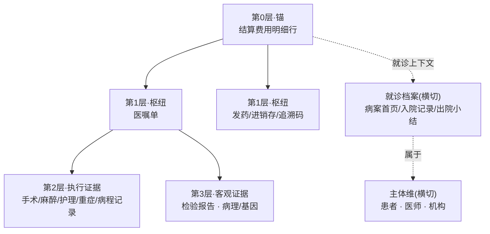

# 鹰眼 · 数据关联模型与证据链完整度 — 实现规格 v2.0

> 交给 Claude Code 执行。当前问题(见截图):患者就诊材料包 13 种材料平铺为同级 tab,费用清单混在其中当普通材料——无锚点、无分层、无关联、无完整度概念。
> 本文档包含设计推理,遇到规格未覆盖的情况,按 §1 的推理原则自行决策,不要发明新原则。

---

## 0. 快速导航

- 只想开工:直接读 §2 验收标准 → §9 实现顺序 → 回头查细节。
- §1 是设计哲学,决定所有含糊处的裁决方向。
- §10 是反模式清单,写代码前扫一遍。

---

## 1. 设计哲学与思考链路(为什么是这个方案)

### 1.1 审核的第一性原理:钱 → 行为 → 指征

医保审核的本质问题只有一个:**这笔钱该不该付?** 回答它需要逐级举证:

```
这笔钱(费用明细行)
 └── 有没有人下令花?(医嘱)          ← 合法性
      └── 下令的事真做了吗?(执行记录)  ← 真实性
           └── 做这件事有依据吗?(客观报告) ← 合理性
```

合法性、真实性、合理性,正是稽核实务的三问。所以数据分层不按材料类型分、不按科室分、不按时间分,**按"离钱多远"分**——每一层回答一问。这是整个方案的推理根。

### 1.2 为什么锚是"费用明细行",三个备选为什么被否

| 备选锚 | 为什么否 |
|---|---|
| 以**患者**为中心(现状的隐含模型) | 患者是背景不是审核对象;疑点无法归属到患者级——"这个患者违规了¥X"没有意义,"这笔费用违规了"才有意义 |
| 以**就诊**为中心 | 粒度太粗:一次住院几百条费用,疑点、金额、证据都发生在行级;就诊级只适合做汇总视图,不适合做工作单元 |
| 以**材料/文书**为中心(现状的显式模型,13 个平铺 tab) | 材料是证据不是问题;审核员的任务清单永远是"处理这 N 条疑点费用",没有人的工作流是"今天读完 13 份文书" |

**费用明细行胜出的四个理由**:①它是审核动作的最小闭环单元(一行=一个可判定、可处置、可追回的对象);②疑点、金额、处置天然挂在行上,聚合方向只能自下而上;③与官方结算表结构同构(40 张表里费用明细表就是逐行的),模型即数据,零阻抗;④"人少事多"的解药是队列,队列的元素必须是行,不能是人或文书。

### 1.3 为什么医嘱是唯一的"枢纽层"

13 种材料里只有医嘱单同时满足两个性质:**每笔费用原则上都应指向它**(无医嘱收费本身即违规),且**它向下派生执行**(手术、护理、用药都是医嘱的执行)。所以医嘱不是普通证据,是费用与临床世界之间的**关节**。把它和其他材料平铺,等于把脊椎和肋骨混着数。药品场景中发药/进销存/追溯码承担类似的"钱货对应"关节角色,故与医嘱同层。

### 1.4 为什么"缺失即疑点"是本模块的灵魂

一个只会打分的完整度是装饰品。推理链:必需证据缺失 ⇒ 该费用无法完成三问中的某一问 ⇒ 这不是"数据不全",这**就是**管理类违规的定义(无医嘱收费、有收费无记录)。所以完整度计算器必须与规则引擎双向打通:缺失自动生成疑点;反过来,疑点卡片能解释"缺的是哪一环、期望依据是什么"。做到这一点,本模块从 UI 改造升格为审核能力。

### 1.5 诚实原则(贯穿全部 UI 决策)

推断出来的关联必须**看起来就像推断的**(虚线),不许伪装成显式关联;"材料未提供"与"提供了但对不上"必须视觉可分。理由:评委是内行,会拿边角案例试探;被识破一次伪装,全部可信度归零。宁可显得保守,不可显得聪明。

---

## 2. 验收标准

1. 打开案卷,第一视图是**费用明细行列表**(锚视图),每行显示:项目名称、金额、医保编码、疑点档徽章(明确违规/可疑/干净)、完整度徽章(完整/部分/薄弱)。
2. 点击费用行 → 中栏展开**证据链视图**:四层纵向排列;已召集节点实心可点、角标区分匹配方式;期望但缺失的节点灰色虚框显示缺失原因。
3. 点击证据节点 → 右栏打开材料原文并滚动定位到相关行(复用既有 evidence 锚点机制)。
4. 任一材料页头显示反向索引:"本材料被 N 笔费用引用",可点击跳回。
5. 完整度徽章只出现在费用行级与案卷头(数据侧);规则覆盖度保持在规则面板(规则侧)。两者不同屏区、不同配色、不同措辞,永不并排。
6. 原 13 个 tab 降级为页面底部折叠抽屉"原始材料库",仅供顺序翻阅。
7. 必需证据 match_type=none 的费用行,自动出现一条对应的管理类疑点卡片,卡片内能看到"期望依据"。
8. bench 20 案卷回归通过:干净件案卷级完整度 ≥0.85;含预埋"缺证据"违规的案卷,对应疑点被自动生成。

---

## 3. 实体分层模型



### 3.1 十三种材料的归属及理由

| 材料 | 层 | 归属理由 |
|---|---|---|
| 费用清单 | 第 0 层(拆行) | 锚本体;**不作为一份"材料"展示,拆为逐行审核对象** |
| 药店/进销存 | 第 0/1 层 | 药店场景中自身是锚;医院场景中是药品费的钱货对应枢纽 |
| 医嘱单 | 第 1 层 | §1.3;费用合法性的第一证人 |
| 手术记录 | 第 2 层 | 手术类医嘱的执行证明 |
| 麻醉记录 | 第 2 层 | 麻醉费的执行证明;同时为手术真实性的旁证(有手术必有麻醉,反之校验) |
| 护理记录 | 第 2 层 | 护理费的执行证明;等级与天数需与医嘱、收费三方吻合 |
| 重症记录 | 第 2 层 | 监护费执行证明 |
| 病程记录 | 第 2 层 | 泛用执行旁证,权重最低(叙事性强、结构化弱) |
| 检验报告 | 第 3 层 | 检验费的直接对应物;同时是指征药/指征手术的合理性证据 |
| 病理/基因 | 第 3 层 | 靶向药、病理项目的合理性证据(NSCLC 主线的关键) |
| 病案首页 | 就诊档案 | 就诊级汇总(诊断、DRG 入组),服务所有费用行,不隶属任何一行 |
| 入院记录 | 就诊档案 | 在院区间起点、入院诊断与指征 |
| 出院小结 | 就诊档案 | 在院区间终点、出院诊断 |

**判定原则(遇到新材料类型时用)**:能回答"这笔钱是谁下令的"→ 第 1 层;能回答"下令的事做没做"→ 第 2 层;能回答"做这事有没有依据"→ 第 3 层;回答的是就诊整体而非单笔费用 → 就诊档案。

---

## 4. 关联键与解析器(evidence-resolver)

### 4.1 键规范

| 键 | 语义 | 来源字段(对齐官方结算口径) | 用途 |
|---|---|---|---|
| `patient_id` | 人员编号 | psn_no | 全局隔离,任何跨 patient 的匹配都是 bug |
| `encounter_id` | 就诊 ID | mdtrt_id | 匹配的默认边界:**所有推断匹配限定在同一 encounter 内** |
| `settlement_id` | 结算 ID | setl_id | 结算批次归属 |
| `fee_line_id` | 费用明细流水号 | feedetl_sn | **锚主键** |
| `order_id` | 医嘱 ID | 医嘱表主键 | 显式直连键 |
| `med_code` | 医保目录编码 | med_list_codg | 推断匹配主通道 + 规则/编码集合入口 |
| `trace_code` | 药品追溯码 | 追溯码明细表 | 回流药规则专用 |
| `doctor_id` / `org_id` | 医师/机构编码 | 相应字段 | 主体维规则挂载 |
| `fee_time` | 费用发生时间 | fee_ocur_time 等 | 时间窗匹配 |

### 4.2 解析策略:四级降级

```
resolve(fee_line) →
  L1 显式外键:fee_line.order_id 非空且命中          → match_type: explicit   权重 1.00
  L2 编码+时间窗:同 encounter 内,医嘱.med_code 相同
     且 fee_time ∈ 医嘱执行窗                        → match_type: inferred   权重 0.85
  L3 就诊级兜底:证据只能挂到 encounter 级
     (床位费↔在院区间;就诊档案类天然 L3)             → match_type: contextual 权重 0.60
  L4 无法关联                                        → match_type: none       权重 0
```

**时间窗定义**:临时医嘱 = 开立时间 ±24h;长期医嘱 = [开始时间, 停止时间],无停止时间取出院时间。跨日费用(床位/护理按日计费)逐日与在院区间求交。

**边界情况(必须处理,测试用例见 §9)**:
- **一医嘱多费用行**(拆次执行,如同一长期医嘱下每日发药):合法,多对一,全部 L1/L2;
- **一费用行多候选医嘱**(同码同窗):取时间最近者建链,其余存入 `alternates[]`,UI 角标"存在多候选",完整度按已建链计算但**不升为 explicit**(保持 inferred 折扣,理由:歧义即不确定);
- **负数冲销行**(退费):与原始行配对(同 med_code、金额互反、时间在后),锚视图默认折叠为原始行的"已冲销"标记,不单独参与完整度与疑点(冲销对的净额为 0 的行,规则引擎跳过);找不到配对原始行的孤儿负数行 → 触发信息数据监管类疑点;
- **组套/打包收费**:med_code 为组套码时,期望矩阵按组套类别取值,不拆解到成分(拆解属于规则引擎的事,不是解析器的事);
- **门诊案卷**:床位费、护理费期望自动不适用(以病案首页/就诊类型字段判定门诊|住院,门诊无病案首页则以挂号表判定)。

### 4.3 物化关联表(核心数据结构)

解析结果一次性构建、落库、只读——UI 与完整度计算**禁止**在渲染时现算 join。

```json
// evidence_links 行示例
{
  "fee_line_id": "FD20240613000482",
  "material_type": "surgery_record",      // 枚举:13 种材料类型
  "material_id": "SR2024061201",
  "layer": 2,                              // 0/1/2/3/context
  "match_type": "explicit",               // explicit|inferred|contextual|none
  "anchor_position": {"page": null, "row": 14, "field": "手术名称"},
  "alternates": [],
  "resolved_at": "build_ts"
}
```

构建复杂度 O(F×M) 有界(F=费用行数≈数百,M=各表行数≈千),单案卷构建目标 <500ms;案卷载入时构建一次并缓存,数据变更(mock 回补)时失效重建。

---

## 5. 证据期望矩阵(完整度的分母)

配置文件 `evidence-expectations.json`,**不写死在代码**——它是沉淀 Agent 未来的可写对象,也是三档权重调优的地方。

```json
{
  "drug_western": {
    "required": ["order", "dispense"],
    "optional": ["trace_code"],
    "escalations": [
      {"when": "med_code in codeset:targeted_therapy",
       "add_required": ["pathology_gene_report"],
       "reason": "靶向药需基因检测指征(两库·药品限定支付范围)"}
    ]
  },
  "surgery_fee": {
    "required": ["order", "surgery_record"],
    "optional": ["progress_note"],
    "escalations": [
      {"when": "anesthesia_class == 'general'",
       "add_required": ["anesthesia_record"],
       "reason": "全麻手术必有麻醉记录"}
    ]
  },
  "anesthesia_fee":  {"required": ["order", "anesthesia_record", "surgery_record"], "optional": []},
  "nursing_fee":     {"required": ["order", "nursing_record"], "optional": [],
                      "cross_check": "护理等级与天数须医嘱-记录-收费三方吻合(不吻合→触发规则,非扣分)"},
  "lab_exam_fee":    {"required": ["order", "lab_report"], "optional": ["pathology_gene_report"]},
  "bed_fee":         {"required": ["admission_record", "discharge_summary"], "optional": ["case_front_page"],
                      "note": "L3 contextual 即视为召集,床位费不苛求行级链接"},
  "icu_fee":         {"required": ["icu_record", "order"], "optional": ["progress_note"]}
}
```

费用类别判定:优先收费类别字段,缺失时按 med_code 前缀映射表兜底;两者都无 → 归入 `unclassified`,期望仅 ["order"],并打"类别未识别"标记(诚实原则)。

---

## 6. 完整度算法(含算例)

### 6.1 公式

```
score(fee_line) = Σ_required( w(match_type) × 1.0 ) + Σ_optional( w(match_type) × 0.3 )
                  ─────────────────────────────────────────────────────────────
                  |required| × 1.0 + |optional| × 0.3

w: explicit=1.00, inferred=0.85, contextual=0.60, none=0
```

三档:**完整 ≥0.85|部分 0.50–0.85|薄弱 <0.50**。
案卷级 = Σ(score_i × amount_i) / Σ(amount_i)(金额加权:大钱的证据链更重要)。

### 6.2 算例(NSCLC 主线,写进注释供后来者理解)

费用行:奥希替尼片,¥5,580,类别 drug_western,命中 escalation(靶向药)。
期望:required = [医嘱, 发药, 基因报告],optional = [追溯码]。
解析:医嘱 explicit(1.00);发药 inferred 编码+时间窗(0.85);基因报告 explicit,EGFR 突变阳性(1.00);追溯码 none(0)。

```
score = (1.00 + 0.85 + 1.00 + 0×0.3) / (3×1.0 + 1×0.3) = 2.85 / 3.3 = 0.864 → 完整
```

对照组:麻醉费行 ¥1,200,期望 required=[医嘱, 麻醉记录, 手术记录];医嘱 explicit,麻醉记录 none,手术记录 none:
```
score = 1.00 / 3.0 = 0.333 → 薄弱,且触发两条"缺失即疑点"(§7)
```

### 6.3 分母修正:材料未提供 vs 对不上(诚实原则的算法化)

整类材料在**案卷层面不存在**(如该案卷根本没有麻醉记录表)时:该类证据从所有费用行的分母移除,UI 在证据链视图标注"材料未提供"(灰底斜纹,区别于"缺失"的灰色虚框),**不触发疑点**。
材料存在但该费用行找不到对应条目 → 正常按 none 计,触发疑点。
判据写死:`案卷材料清单` 中该类型条目数 == 0 ⇒ 未提供。

---

## 7. 缺失即疑点联动(与规则引擎的接口)

| 缺失情形(required + none) | 自动触发的规则(管理类) | 疑点档 |
|---|---|---|
| 药品费无医嘱 | 无医嘱收费 | 可疑 |
| 药品费无发药记录 | 收费与发药不符 | 可疑 |
| 靶向药无基因报告 | 超限定支付范围用药(指征缺失) | 可疑 |
| 手术费无手术记录 | 有收费无记录 | 可疑 |
| 麻醉费无对应手术记录 | 收费项目与诊疗行为不符 | 可疑 |
| 检验费无报告 | 有收费无报告 | 可疑 |
| 孤儿负数冲销行 | 结算数据异常 | 可疑 |

接口约定:完整度计算器产出 `missing_evidence[]` 事件 → 规则引擎消费并生成疑点卡片;卡片 `basis` 字段回填期望矩阵条目的 `reason`。**方向单一**(完整度→规则),规则引擎不反向修改完整度——避免循环依赖。
全部落"可疑"档而非"明确违规",理由:缺证据是待解释状态,按官方口径应听取申诉后定,恰好也是三人格合议的入口。

---

## 8. UI 规格

### 8.1 布局

```
┌────────────────────────────────────────────────────────────┐
│ 案卷头:患者摘要 · 案卷完整度徽章(金额加权) · [肿瘤主线·NSCLC▾]│
├───────────────┬─────────────────────────┬──────────────────┤
│ 左:费用锚列表  │ 中:选中行的证据链         │ 右:材料原文       │
│ ·按疑点档分组  │ ·四层纵向:枢纽→执行→客观  │ ·滚动定位锚点行   │
│ ·组内按金额↓   │ ·实心节点=已召集(可点)    │ ·页头反向索引:    │
│ ·行徽章×2:     │   角标:实线L1/虚线L2/点线L3│  "被N笔费用引用" │
│  疑点档+完整度 │ ·灰虚框=缺失(点开看期望依据│                  │
│ ·冲销行折叠    │   +直达联动疑点卡片)      │                  │
│               │ ·灰底斜纹=材料未提供       │                  │
├───────────────┴─────────────────────────┴──────────────────┤
│ ▸ 原始材料库(折叠抽屉:原13类tab收纳,仅供顺序翻阅)             │
└────────────────────────────────────────────────────────────┘
```

### 8.2 状态与交互细则

- 排序切换:金额|完整度升序(专挑薄弱的看,审核员习惯)|疑点档;
- "存在多候选"角标:hover 展示 alternates 列表,可手动改绑(改绑动作写入操作日志——это 沉淀素材);
- 完整度徽章配色独立于疑点档配色(建议:完整度用灰阶/蓝阶,疑点档保留红黄绿),避免两套语义撞色;
- 空态:费用行无任何期望证据(unclassified 且无医嘱)→ 中栏显示"仅上下文材料",不显示空四层骨架;
- 案卷头完整度 hover:展开分布小直方图(完整/部分/薄弱 各多少行、占多少金额)。

---

## 9. 实现顺序与验收用例

### 9.1 顺序(严格依此,理由附后)

1. **evidence-resolver + evidence_links 物化表**(§4)——一切依赖它,先于任何 UI;
2. **evidence-expectations.json + 完整度计算器**(§5–6),含 missing_evidence 事件产出;
3. **规则引擎联动**(§7):消费事件生成疑点卡片;
4. **锚视图三栏 UI**(§8),原 tab 降级为抽屉;
5. **mock 数据回补**:主线案卷费用行埋显式 order_id;**故意保留 2 处 required-none**(麻醉费无手术记录 ×1、靶向药无基因报告 ×1)供演示;另造 1 组冲销对、1 处多候选歧义;
6. **回归**:bench 20 案卷全跑。

理由:UI 最诱人也最不值钱,数据层错了 UI 全白做;联动(第 3 步)先于 UI 是为了第 4 步能直接把疑点卡片挂进证据链视图,免二次返工。

### 9.2 验收用例(期望值精确到档)

| # | 用例 | 期望结果 |
|---|---|---|
| T1 | 奥希替尼行(§6.2 配置) | score≈0.86,完整档;基因报告节点实线 |
| T2 | 麻醉费行,手术/麻醉记录均缺,材料表存在 | score≈0.33 薄弱;生成 2 条可疑疑点;灰虚框可点见期望依据 |
| T3 | 同 T2 但整卷无麻醉记录表 | 麻醉记录从分母移除;显示"材料未提供";只因缺手术记录生成 1 条疑点 |
| T4 | 冲销对(-¥380 对 +¥380) | 锚列表折叠为原始行"已冲销"标记;不计疑点;净额 0 不进规则 |
| T5 | 孤儿负数行 | 触发"结算数据异常"可疑疑点 |
| T6 | 长期医嘱 5 日发药 5 行 | 5 行全 L1/L2,一对多正常 |
| T7 | 同码双医嘱同窗 | 建链最近者,inferred 折扣,"存在多候选"角标,alternates=1 |
| T8 | 干净件(YHF 门禁样卷) | 案卷级 ≥0.85;零疑点(维持零误报门禁) |
| T9 | 门诊案卷 | 床位/护理期望不适用,无相应假性缺失 |
| T10 | 性能 | 单案卷物化表构建 <500ms;锚视图首屏 <1s |

---

## 10. 反模式清单(写代码前扫一遍)

1. **渲染时现算 join** —— 只读物化表,违者重写;
2. 把病案首页/入院记录当作某笔费用的"证据"直连 —— 它们是 L3 上下文,永远点线;
3. 推断匹配画成实线 —— 违反诚实原则(§1.5),内行一眼识破;
4. 完整度与覆盖度并排/同色 —— 语义污染,验收标准 5 直接不过;
5. 缺失只扣分不出疑点 —— 丢掉本模块灵魂(§1.4);
6. "材料未提供"按缺失计 —— 缺表案卷全线低分,评委一试就露馅;
7. 冲销行当独立疑点 —— 假阳性重灾区;
8. 跨 patient/encounter 的推断匹配 —— 数据隔离红线;
9. 在解析器里拆组套、算剂量 —— 那是规则引擎的职责,解析器只管建链;
10. 为了案卷头数字好看调权重 —— 权重改动只允许发生在 expectations.json 并留 git 记录。
