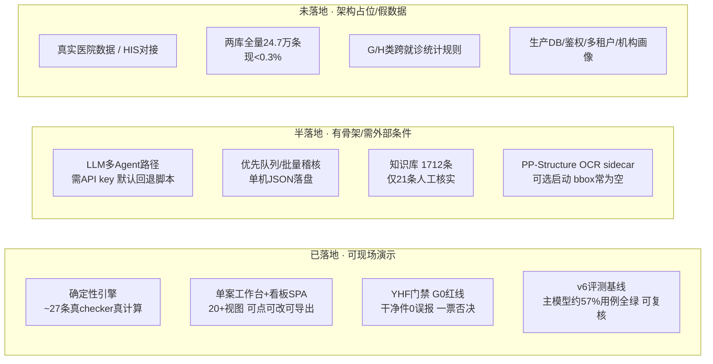

# 鹰眼 · 现状梳理与结构性重构议题 Briefing

> 用途：给「和 Claude 讨论如何让鹰眼更可落实、更贴近真实场景」提供**共同的事实基础 + 待决策议题清单**。
> 定位：本文只做梳理与议题呈现，**不替你拍板方案、不修改任何代码/数据/规则**。
> 生成日期：2026-07-02。事实基础来自对全仓四条线的深度只读探索（见附录链接）。

---

## 第一部分 · 现状全景（事实基础）

### 一句话本质判断

**鹰眼是一个工程完成度很高的黑客松 demo，其"设计成熟度"显著领先于"落地成熟度"。**

四条线（战略文档 / 原型引擎 / 评测体系 / 知识库）都已经过多轮迭代打磨，文档层甚至已经完成了从"33+8 条规则草案 → 架构 v2 → SSOT 战略重塑 + 术语红线"的诚实收敛。但真正"能被真实医院/医保局试用、能靠真实数据支撑、能被目标模型验证"的部分，仍集中在少数几个精心构造的 demo 主线上。

值得强调：这不是贬义。文档层（尤其 `docs/鹰眼-战略主文档-SSOT.md` 和 `prototype/docs/ARCHITECTURE_REVIEW.md`）已经**主动、诚实地标注了这些落差**——这为结构性重构提供了很好的起点，说明团队并不活在"自我叙事"里。重构要做的，是把"已经诚实承认的落差"变成"有优先级的落地路线"。

### 四维成熟度矩阵（设计完成度 vs 落地完成度）

| 维度 | 设计完成度 | 落地完成度 | 差距点 |
|---|---|---|---|
| **战略/产品文档** | 高（SSOT v2.0 + 8 维证据底座 + 术语红线） | — | 定位诚实、边界清晰；主要风险是"矩阵铺得宽"（2 受众 × 3 阶段） |
| **原型引擎** | 高（L1–L6 分层 + 触发器路由 + 三要素门禁 + 合议层） | 中 | 58 条规则库 vs ~27 条真 checker；控辩裁/CoVe 默认走脚本 |
| **评测体系** | 高（7 prompt × 红队迭代 + YHF 五层门禁 + G0 红线） | 中低 | v6 有基线，v7 全量未跑完；从未在目标模型 Claude 上验证；三套评测互相孤岛 |
| **知识库/数据** | 高（KB1 五层 + KB2 病种包 + 数据源调研摸清 URL） | 低 | 1712 条里仅 1.4% 人工核实；两库全量不可爬，现有 <0.3% |

### 三档能力分布

---

## 第二部分 · 落差账本（Gap Ledger）

> 每条落差按「文档/直觉宣称 → 实际现状 → 证据文件」呈现。所有路径均可点开核实。

### A · 数据真实性

| 项 | 宣称 | 实际现状 | 证据文件 |
|---|---|---|---|
| 案卷数据 | 演示各专科真实审核能力 | **全部为团队构造的虚构 demo 包**，违规点手工预埋（6 违规 + 2 干扰） | [prototype/data/case_NSCLC/medical_record.json](../prototype/data/case_NSCLC/medical_record.json)（`disclaimer` 字段明写"演示用虚构数据"，`embedded_violation_count: 7`） |
| 金标准/基准 | AuditBench 20 案卷 | 团队自标金标准，**非外部验证集**，SSOT 已明确"泛化需试点" | `docs/鹰眼-战略主文档-SSOT.md` §5.2；[prototype/data/case_registry.json](../prototype/data/case_registry.json) |
| KB 可信度 | 1467 条政策/规则可溯源 | **仅 21 条（1.4%）人工核实**，其余 1446 条为"爬虫入库待抽检" | [prototype/data/kb/kb1_policies.json](../prototype/data/kb/kb1_policies.json)（各条 `verify_status`） |

### B · 引擎 / 能力真实性

| 项 | 宣称 | 实际现状 | 证据文件 |
|---|---|---|---|
| 规则覆盖 | 58 条操作化规则 | 规则库有 58 条 `rule_id`，但**只有约 27 条有真 checker 会 fire**；其余（多为 L2 语义类）不产出结果，除非走 LLM | [prototype/app/engine/audit-engine.js](../prototype/app/engine/audit-engine.js)（`ruleCheckers` 对象）；[prototype/data/rules/rules.json](../prototype/data/rules/rules.json) |
| 控辩裁 / CoVe | 多 Agent 辩论式审核 | **默认确定性路径下是预置推演脚本**，不是真 LLM 辩论 | [prototype/app/engine/debate.js](../prototype/app/engine/debate.js)（头部注释）；`prototype/docs/ARCHITECTURE_REVIEW.md` |
| 自然语言推理 | 引擎输出推理链 | 确定性检测是真计算，但**推理文字/reasoning 为模板** | `docs/鹰眼-战略主文档-SSOT.md` §2.2 |
| 单文件耦合 | — | `runAudit` 遍历全部 `ruleCheckers` 后再路由，逻辑集中 | [prototype/app/engine/audit-engine.js](../prototype/app/engine/audit-engine.js) L1209–L1321 |

### C · 评测可信度

| 项 | 宣称 | 实际现状 | 证据文件 |
|---|---|---|---|
| v6 基线 | 已有真实回归结果 | ✅ 真实存在：主模型 MiniMax **约 57% 用例（21/37）全绿**；**P4/P6 有致命失败**（P4-C1 铁证认账 0/5、P6-C2 错并 3/5） | [eval/results/report_tables_v6.md](../eval/results/report_tables_v6.md) |
| v7 迭代 | 失败驱动已修复 | v7 prompt 文案已写，但**全量回归未跑完**，`v7_lowtemp.json` 不存在，CHANGELOG 转绿数字全为【待填】 | [eval/CHANGELOG.md](../eval/CHANGELOG.md)；`eval/results/`（无 v7 全量产物） |
| 目标模型验证 | 面向 Claude 设计 | **从未在 Claude 上跑过**（`ANTHROPIC_API_KEY` 空），全部结果基于 MiniMax | [eval/results/00_methodology.md](../eval/results/00_methodology.md) |
| 端到端打通 | 完整审核链路 | eval 测**单 prompt 单轮**（47 段合成短文本），与 prototype 的 `/api/audit` 编排链**脱节**；三套评测（eval / bench / shadow）互为孤岛 | [yhf/README.md](../yhf/README.md) §1；[eval/evals/cases/](../eval/evals/cases/) |
| P5 位置去偏 | 裁判去偏 | 测出"自检无效"（v7 双跑改善到 6/6），但**未在调用层双跑兜底** | [eval/OPEN_ISSUES.md](../eval/OPEN_ISSUES.md) B1 |

### D · 知识库

| 项 | 宣称 | 实际现状 | 证据文件 |
|---|---|---|---|
| 两库全量 | 站在国家两库肩上 | 两库全量 88 类/24.7 万条是**出版物，不可爬**；现入库 781 条（col109 逐批 xlsx），**距全量 <0.3%** | [医保智能审核Agent_KB1_数据源调研.md](../医保智能审核Agent_KB1_数据源调研.md) |
| 两库解析质量 | 已入库 | 781 条中 **~22%（172 条）解析异常**（text="序号"/"1"等） | [public-data-corpus/manifest.json](../public-data-corpus/manifest.json)；[prototype/data/kb/kb1_policies.json](../prototype/data/kb/kb1_policies.json) |
| 药品目录 | 2025 版 3253 种 | 仅 **13 行（5 demo + 8 PDF 抽样）**，全量 0.4% | [prototype/data/kb/kb1_policies.json](../prototype/data/kb/kb1_policies.json)（`KB1-目录2025`） |
| 临床知识库 | KB2 病种包 | **仅 9 条**；临床路径 224 病种、抗菌药物指导原则均未建库 | [prototype/data/kb/kb2_clinical.json](../prototype/data/kb/kb2_clinical.json) |
| 江苏覆盖层 | 全国基线+江苏层 | 161 条通知摘要；护理 PDF **403 抓取失败**，xlsx 工作版待蹲守 | `public-data-corpus/manifest.json`（batch2 `needs_playwright`） |

### E · 架构 / 代码结构

| 项 | 现状 | 证据文件 |
|---|---|---|
| 引擎模块数 | `prototype/app/engine/` 约 **40 个模块**，职责细但分层不显式 | [prototype/app/engine/](../prototype/app/engine/) |
| 路由集中 | `server.js` 单文件承载 **50+ 个 `/api/*` 路由** | [prototype/app/server.js](../prototype/app/server.js) |
| 深度不均 | 肿瘤/骨科/DRG 深，其余领域仅规则条目——架构无重大错误，主要是"深度不均" | [prototype/docs/ARCHITECTURE_REVIEW.md](../prototype/docs/ARCHITECTURE_REVIEW.md) |
| 数据形态混杂 | 结构化 JSON 案卷 + 可选 sidecar，bbox 锚点常为 null | [prototype/app/engine/case-object.js](../prototype/app/engine/case-object.js) |

### F · 可交付 / 生产化

| 项 | 宣称 | 实际现状 | 证据文件 |
|---|---|---|---|
| 存储 | — | 优先队列/批量/复核**全部本地 JSON 文件落盘**，无 DB | [prototype/data/priority/store.json](../prototype/data/priority/store.json)；`prototype/data/audit_batch_jobs.json` |
| 闭环 | 采纳/驳回/规则沉淀 | 部分 API 有，**闭环不完整**（审查称"点了无后续"）；`eval_draft_queue.json` pending | [prototype/data/eval_draft_queue.json](../prototype/data/eval_draft_queue.json)；`ARCHITECTURE_REVIEW.md` |
| 机构画像/批量 | 机构级万案 | **架构占位 + 假数据**（ROADMAP Phase 7 未开始） | [docs/ROADMAP.md](ROADMAP.md) |
| 集成 | HIS/FHIR 对接 | **MockHIS 可跑，FHIR/HL7 仅契约级骨架**；无真实事中拦截 | [prototype/app/connectors/hospital.js](../prototype/app/connectors/hospital.js) |
| 鉴权/多租户 | — | **无**（ROADMAP Phase 8 未开始） | `docs/ROADMAP.md` Phase 8 |

### G · 范围聚焦

| 项 | 现状 | 证据文件 |
|---|---|---|
| 受众×阶段 | **2 受众（监管/院端）× 3 阶段（事前/事中/事后）** 矩阵，铺得较宽 | [docs/鹰眼-战略主文档-SSOT.md](鹰眼-战略主文档-SSOT.md) §4 |
| 专科覆盖 | 肿瘤/骨科/DRG/影像/麻醉/ICU/药店有 checker；**其余 12 领域多为占位** | [docs/00-项目主文档.md](00-项目主文档.md) §7 |
| 前端页面 | home/index/intake/priority/dashboard **5 个页面 + 20+ 视图**，功能面广 | [prototype/app/public/](../prototype/app/public/) |

---

## 第三部分 · 结构性重构议题清单（待决策叉路）

> 按你选定的六个焦点组织。每个议题给出「核心问题 + 取舍路径 + 涉及的现有文件」，**留给你和 Claude 讨论决策**，本文不给结论。

### 议题 1 · 数据真实性：广度 vs 深度

- **核心问题**：KB 与案卷是"继续铺广"，还是"锁定极少数场景做到真实可核实"？
- 取舍路径：
  - (a) **广度优先**：修 two-库 xlsx parser、增量抓 col109、扩问题清单——但两库全量本质不可爬，天花板明确。
  - (b) **深度优先**：锁定 1–2 个病种（如 NSCLC），把该病种相关的 50–100 条 KB 做到**逐条人工核实 + 真实脱敏案卷**，其余明确标"演示占位"。
  - (c) **混合**：核实子集做产品主线，爬虫大批量仅作"检索召回背景"，明确不作认定依据。
- 涉及文件：[医保智能审核Agent_KB1_数据源调研.md](../医保智能审核Agent_KB1_数据源调研.md)、[prototype/data/kb/](../prototype/data/kb/)、[scripts/crawl/](../scripts/crawl/)

### 议题 2 · 聚焦范围：主战场押哪个

- **核心问题**：重构后主打**监管侧飞检**还是**院端自查**（商业楔子）？还是继续双线？
- 取舍路径：
  - (a) **押监管飞检**：信誉锚、场景权威，但客户少、销售周期长、数据获取难。
  - (b) **押院端自查**：政策强制 + ROI 清晰（避免一次飞检损失），更易冷启动付费；SSOT 已把它定为"商业首楔子"。
  - (c) **双线保留**：叙事完整但资源分散，重构难以收敛。
- 连带影响：选定后可**砍掉另一侧的占位页面/模式**，收敛前端与规则范围。
- 涉及文件：[docs/鹰眼-战略主文档-SSOT.md](鹰眼-战略主文档-SSOT.md) §4、[docs/deliverables/鹰眼-院端自查一页纸.md](deliverables/鹰眼-院端自查一页纸.md)

### 议题 3 · 能力真实性：脚本 → 真跑

- **核心问题**：默认审核路径是否从"确定性引擎 + 模板辩论"改为"真跑 LLM"？OCR bbox 是否真填？
- 取舍路径：
  - (a) **保持确定性为默认**：毫秒级、可复现、演示稳；但控辩裁/推理是脚本，"多 Agent"名不副实。
  - (b) **真 LLM 为默认**：真读病历、真辩论，但慢（~80s/条）、需 key、需成本/延迟管控，且要先在目标模型上验证。
  - (c) **分层**：确定性做 L1 硬判定，LLM 只在高风险 L2 疑点上真跑（与文档"触发器路由 + 贵调用短路"一致）。
- 涉及文件：[prototype/app/engine/llm-agent.js](../prototype/app/engine/llm-agent.js)、[prototype/app/engine/debate.js](../prototype/app/engine/debate.js)、[prototype/ppstructure/server.py](../prototype/ppstructure/server.py)

### 议题 4 · 可交付：谁试用、怎么接、怎么部署

- **核心问题**：第一个真实试点对象是谁？以什么方式集成与部署？
- 取舍路径：
  - 集成：(a) **材料包导入**（轻集成、数据不出域、最易落地）vs (b) **HIS/结算系统对接**（重、需逐院定制）。
  - 存储：本地 JSON → 需否上 DB（Supabase schema 已设计但未确认全量 ingest）。
  - 部署：单机 `node server.js` → 私有化部署 / 云托管（已有 Vercel + Render 实验配置）。
  - 闭环：采纳/驳回/规则沉淀是否要做成完整工单闭环。
- 涉及文件：[prototype/app/connectors/hospital.js](../prototype/app/connectors/hospital.js)、[supabase/migrations/](../supabase/migrations/)、[docs/ROADMAP.md](ROADMAP.md) Phase 7/8

### 议题 5 · 技术架构：分层重组与孤岛合流

- **核心问题**：代码结构是否需要在重构中显式分层、拆分、合流？
- 取舍路径：
  - (a) **引擎分层**：把 `engine/` 40 模块按 L1解析 / L2事实 / L4规则 / L5验证 / 合议 显式分层，规则 checker 与引擎主逻辑解耦（便于加专科不改主流程）。
  - (b) **路由拆分**：`server.js` 50+ 路由按域拆（case/audit/intake/priority/governance/kb）。
  - (c) **三套评测合流**：eval（prompt）↔ bench（案卷）↔ shadow（治理）打通为一条 CI 门禁，解决孤岛。
- 涉及文件：[prototype/app/server.js](../prototype/app/server.js)、[prototype/app/engine/audit-engine.js](../prototype/app/engine/audit-engine.js)、[yhf/README.md](../yhf/README.md)

### 议题 6 · 可信度：验证优先级

- **核心问题**：三件"欠账"——v7 全量回归 / Claude 目标模型验证 / eval↔engine 端到端打通——先做哪个？
- 取舍路径：
  - (a) **先跑 v7 全量 + 补 Claude**：把评测数字补齐，让"57% → ?%"有真实结论（`run_v7.sh` 第 3 步未落盘）。
  - (b) **先端到端打通**：让 eval 用例直接喂 prototype 编排链，暴露单 prompt 测不出的链路 bug。
  - (c) **先补 P5 调用层双跑兜底**：把已知的"自检无效"落成工程护栏。
- 涉及文件：[eval/CHANGELOG.md](../eval/CHANGELOG.md)、[eval/run_v7.sh](../eval/run_v7.sh)、[eval/OPEN_ISSUES.md](../eval/OPEN_ISSUES.md)

---

## 第四部分 · 关键"重构分叉"（最影响全局的战略选择）

> 上面六个议题最终会收敛到下面 3 个大叉路。这几个选择一旦定下，会连锁决定其余所有细节。建议这几个作为和 Claude 讨论的**开场主轴**。

### 分叉一 · 「广覆盖 demo」 vs 「单场景可落地产品」

这是最根本的一叉。当前鹰眼是"什么专科都能演一点、什么受众都照顾到"的广覆盖 demo。

- 若选 **单场景可落地产品**：锁定 1 受众 + 1 病种/领域，把数据、KB、规则、评测、闭环在这一条线上做到**真实可核实、可试点**，其余全部降级为"路线图占位"。
- **连锁影响**：议题 1 选深度、议题 2 选单主战场、议题 5 允许砍前端、议题 6 只需在这条线上验证——所有子决策都随之收敛。
- 代价：叙事的"全面性"会收窄，路演故事需重写。

### 分叉二 · 「确定性引擎为主」 vs 「真 LLM Agent 为主」

决定产品的技术身份是"规则引擎"还是"AI Agent"。

- 当前默认是确定性引擎，LLM 是可选增强、且未在目标模型验证。若要名副其实的"审核 **Agent**"，需要把 LLM 路径真跑通、验证、并解决成本/延迟/可复现。
- **连锁影响**：直接决定议题 3、议题 6 的优先级，以及评测体系要不要重心从"prompt 单测"转向"编排链端到端"。
- 代价：真 LLM 路径的稳定性和可演示性远低于确定性引擎，现场演示风险上升（见 `prototype/docs/PREMORTEM.md`）。

### 分叉三 · 「继续 demo 数据」 vs 「拿到真实脱敏数据」

决定项目能否真正"贴近真实场景"的物理前提。

- 没有真实（哪怕极少量）脱敏案卷，"贴近真实场景"就只能停留在构造数据上。这一叉的答案往往取决于**能否找到愿意提供数据的试点方**——是外部约束，不完全是技术决策。
- **连锁影响**：如果短期拿不到真实数据，则议题 1/4 应转向"把 demo 数据的真实度和 KB 核实度拉满 + 把集成做成数据不出域的私有化，以便未来一旦有试点方即可接入"。
- 建议在和 Claude 讨论前，先想清楚：**未来 1–3 个月，有没有可能接触到一个真实院端/监管方？**（这个答案会反向决定前三叉怎么选。）

---

## 附录

### 关键文件索引

| 维度 | 入口文件 |
|---|---|
| 战略/产品（对外权威口径） | [docs/鹰眼-战略主文档-SSOT.md](鹰眼-战略主文档-SSOT.md) |
| 工程主文档 | [docs/00-项目主文档.md](00-项目主文档.md) |
| 路线图（Phase 进度） | [docs/ROADMAP.md](ROADMAP.md) |
| 原型诚实自审 | [prototype/docs/ARCHITECTURE_REVIEW.md](../prototype/docs/ARCHITECTURE_REVIEW.md) |
| 确定性引擎主逻辑 | [prototype/app/engine/audit-engine.js](../prototype/app/engine/audit-engine.js) |
| 规则源（人读+机读） | [prototype/data/rules/rules.yaml](../prototype/data/rules/rules.yaml) |
| 评测方法学 | [eval/results/00_methodology.md](../eval/results/00_methodology.md) |
| 评测 v6 结果 | [eval/results/report_tables_v6.md](../eval/results/report_tables_v6.md) |
| 评测未决问题 | [eval/OPEN_ISSUES.md](../eval/OPEN_ISSUES.md) |
| YHF 门禁设计 | [yhf/README.md](../yhf/README.md) |
| KB 数据源调研 | [医保智能审核Agent_KB1_数据源调研.md](../医保智能审核Agent_KB1_数据源调研.md) |
| KB 语料清单 | [public-data-corpus/manifest.json](../public-data-corpus/manifest.json) |

### 四份深度探索（可按维度回溯细节）

- [docs 战略与文档体系梳理](f03bdb06-8bf1-4bc7-919f-7cfb7be8a568)
- [prototype 原型引擎与前端现状](e43c5c3e-b02b-4ffd-b0b9-d14e94dad217)
- [eval 评测与 Prompt 工程演进](5b7a08ae-8272-4382-996d-d6bdc7002a34)
- [知识库与数据源调研现状](86081e2e-8388-4227-9a70-736ba35fdc7a)

---

## 第二轮补充诊断（2026-07-02）

在本文基础上，针对四个具体问题完成了第二轮代码级诊断，详见 **[鹰眼-四大问题诊断与改进建议.md](鹰眼-四大问题诊断与改进建议.md)**：

1. **KB/两库录入效率**（对应议题 1）：五大瓶颈——seeds 手写、两库 xlsx ~22% 坏行、PDF demoOnly 截断、无本地批量导入、核实无工作流且 verified 判断存在实质 bug；给出按性价比排序的六条改进建议。
2. **医院接入 + OCR 批量导入**（对应议题 3/4）：用医保工作人员访谈证据（收费=标准化编码、病历=零散 PDF）验证产品主张；关键缺口是 FHIR 拉取未实现、无医保码字段、API 与 OCR 两路未按就诊号合并、一等槽位（结算清单/DRG/追溯码）合并不通。
3. **自查自纠强化**（对应议题 2）：骨架最全的一条线，闭环缺四块——全量 12 领域可勾选清单工作台（KB 已有 236 条原文）、整改复跑 diff、主动退回金额测算、violation_nature 与 exam 子集的一致性修复。
4. **规则粒度与交叉重组**（对应议题 5）：58 条规则粒度两极（A-107 三合一过宽 / T-201 硬编码 6 药过窄）+ 重复收费散在 8 条 + reconcile 不读 relations；给出「违规行为本体 × 专科场景」二维矩阵重组方案与优先拆分清单。

其中**规则重组**与**录入流水线**不依赖第四部分任何分叉的答案，属于"无论战略怎么选都要做"的公共地基。
